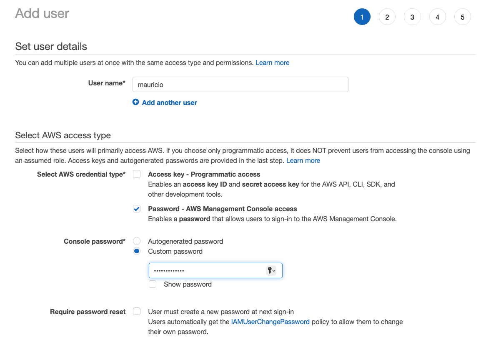

# IAM Hands On

During this Hands On you will lean how to:
1. Create an IAM Group
1. Create an IAM user included in the IAM Group.
1. Create an IAM role, attach it to an IAM user and switch role to the user
1. Create a policy, attach it to an IAM user and test it.

## Deliverables
1. A screenshot of the created User Group
1. A screenshot of the created User
1. A screenshot of the created role
1. A screenshot of a successfull switch to another role
1. A picture of a successfully launched EC2 instance, while signed in as the user that was created in the hands on

## IAM User Group Creation
1. Sign in to AWS Management Console and open the IAM Console
    
1. On the right navigation pane, choose User groups and then click Create group.
    
1. For User group name, type the name of the group `Training`, don't do anything else, and click `Create Group`
1. You should now see the `Training` group

     

## IAM User Creation
1. In the navigation pane, choose Users and then choose Add Users.
    
1. Create user
    1. Type your name as the username
    1. Select `Password - AWS Management Console Access`
    1. Select `Custom Password`
    1. Enter a custom password
    1. **Uncheck** `Require password reset`

        
1. Click `Next: Permissions`
    1. Add User to the Training group

        
1. Click `Next: Tags`
1. Click `Next: Review`
1. Click `Create User`
1. Click  `Close`

## Create an IAM Role with Admin Access
1. Go to the IAM console, in the Navigation pane, choose Roles
1. Click `Create Role`

    
1. Configure Role
    1. Select AWS Account
    1. Select `This account` (*Copy the account number you will need it later*)
    1. Click Next

         
    1. Search for `AdministratorAccess` policy, select it, and click `Next` 

        
    1. Name the role `AdministratorAccess` and click `Create Role` (Yes it is misspelled in the picture by accident)

        
    1. Clock on your username on the top right of the screen, and click on switch role.

        
    1. Configure role switch
        1. Enter the account number you copied in a previous step
        1. Enter the name of the role `AdministratorAccess`
        1. Select a color
        1. Click Switch Role
            
            
        
    1. You should now be assuming another role as shown in the top right of the screen

        

    ## Create IAM Policy with Full EC2 Access
    1. Go to the IAM console, in the Navigation pane, choose Policies
    1. In the search bar, write EC2 and press `Enter`. Select `AWSEC2FullAccess`, select it, click on `Actions` next to the search bar, and choose `Attach`

        

    1. Select the user you created at the beginning of the hands on and click `Attach` at the bottom.

        

    1. Sign out of AWS
    1. Log back in with the user you created at the beginning of the hands on
    1. Go the EC2 console, create an EC2 instance with any name, the details of the EC2 instance do not matter, just create one. If you are able to create one then you successfully configure the user with an attached policy.

        